## Inventory Management System with Automated Web Testing using Python and Selenium
This project is an Inventory Management System with Automated Web Testing that streamlines product tracking, stock updates, supplier management, and sales monitoring. 
The system ensures accuracy and efficiency through real-time inventory control and automated testing to validate core functionalities across workflows. This project has three types 
of users: admin, customer and employee.

### Final Result of Project
#### Login Page

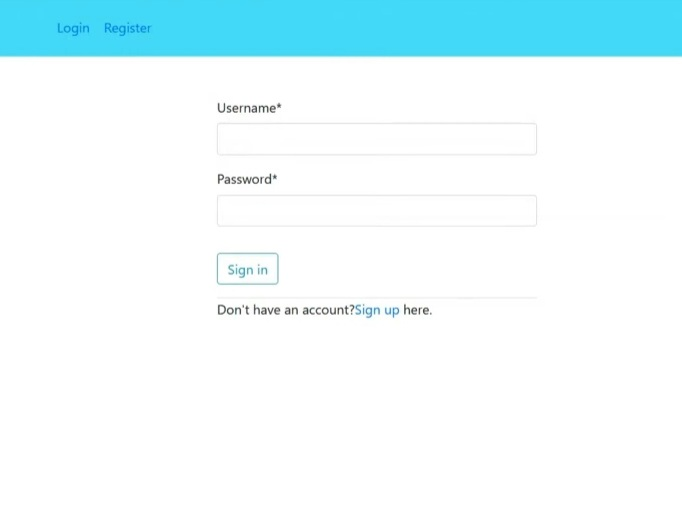

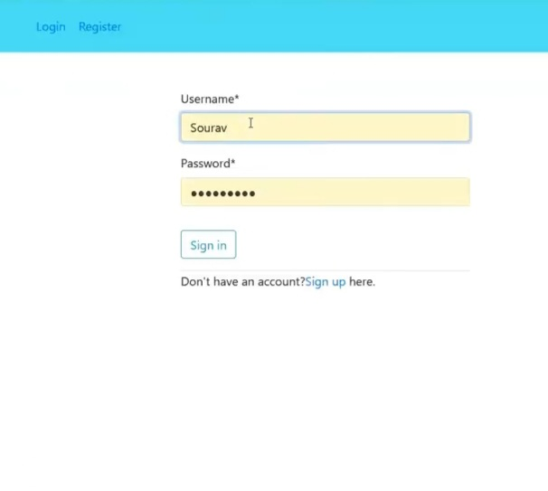

#### Registration form for new users

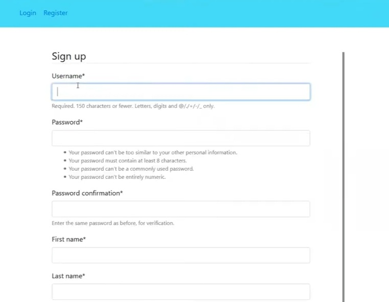

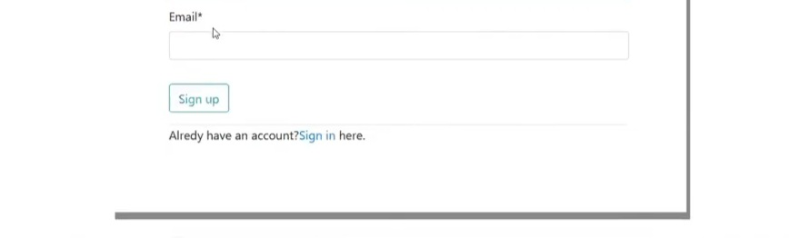

#### Front Page

#### Update Profile

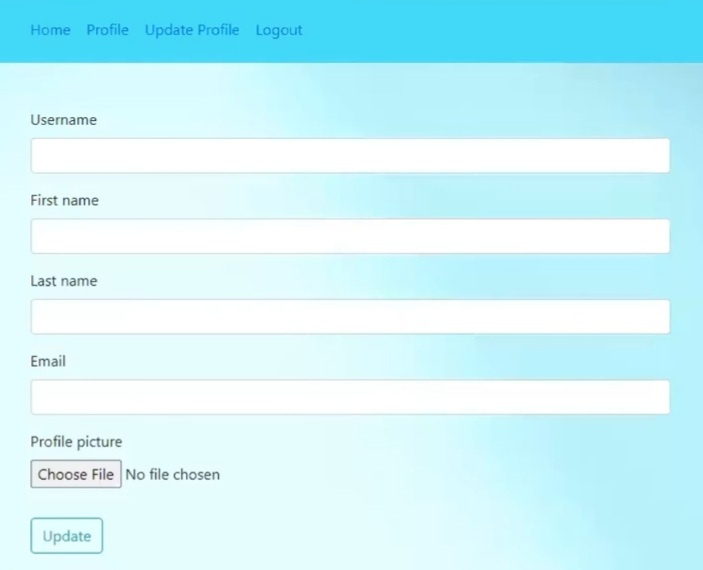

#### Change Password

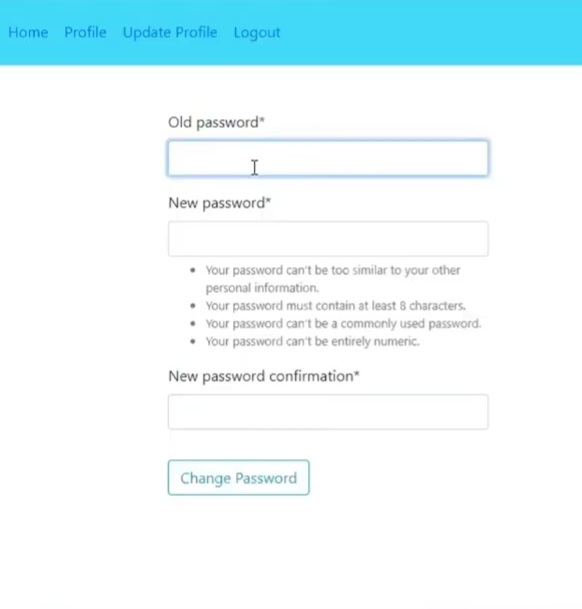

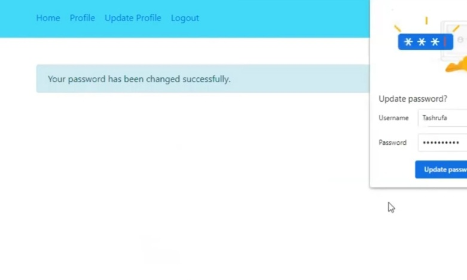

#### Log Out

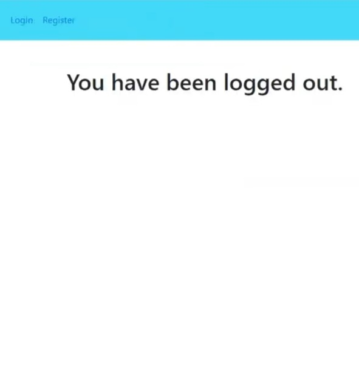

### Admin

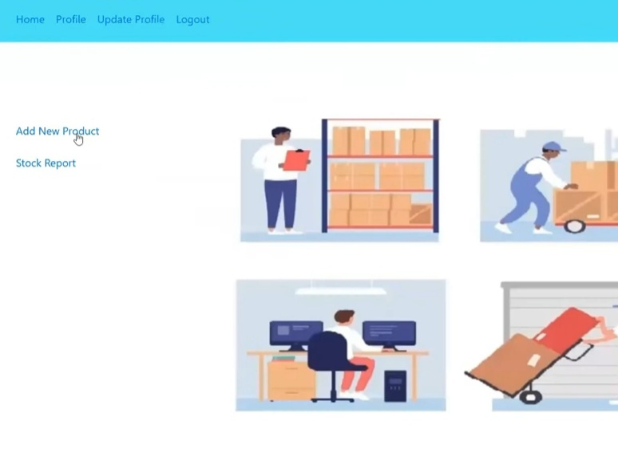

#### Adding New Product Form

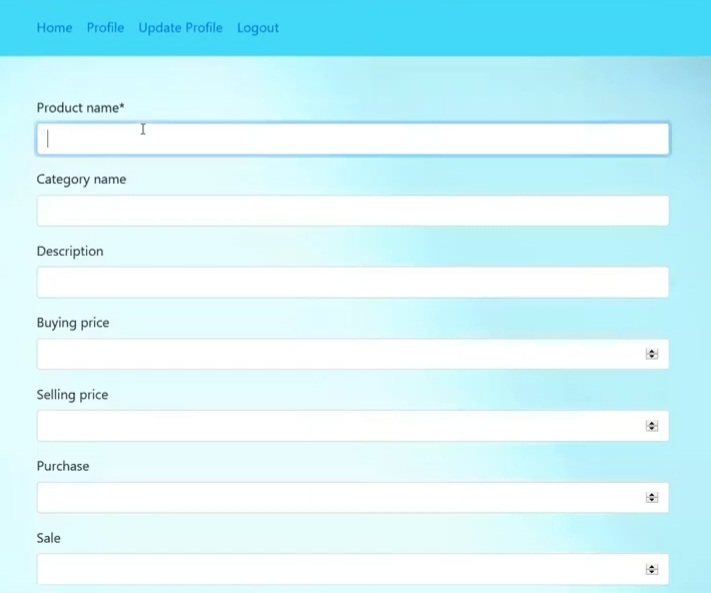

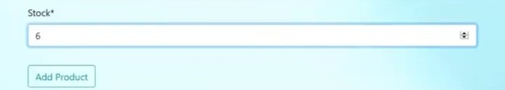

#### Stock Report

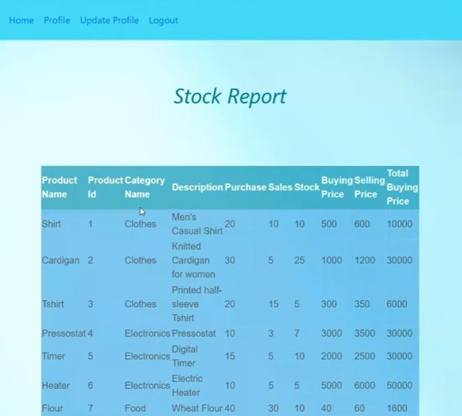

### Customer
#### Buy Products

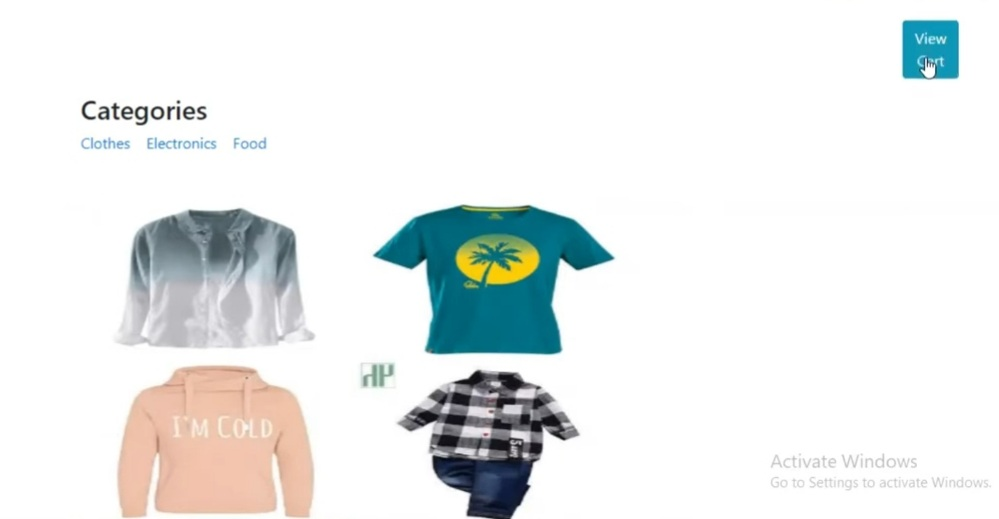

#### Buy Clothes

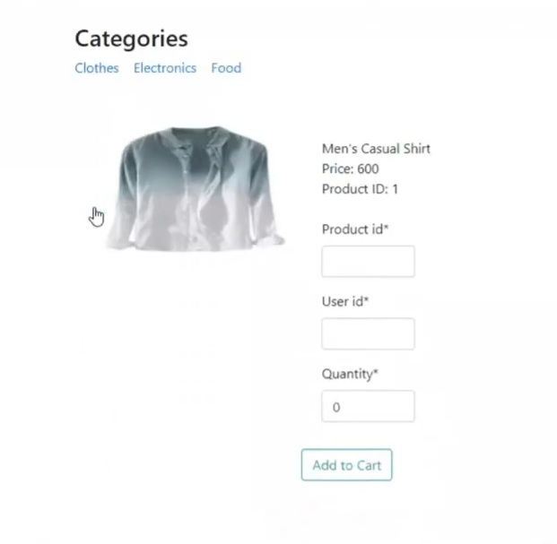

#### Buy Electronics

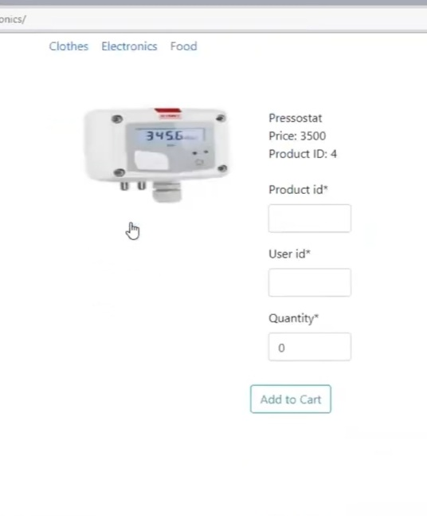

#### Buy Food

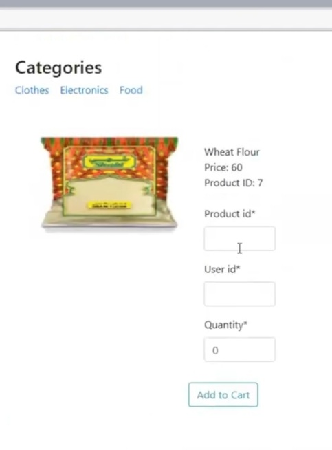

#### Adding Customer Details Form

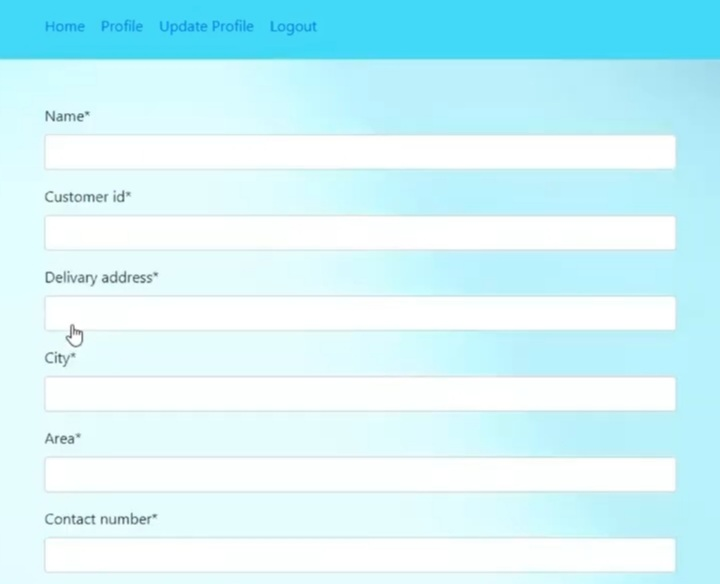

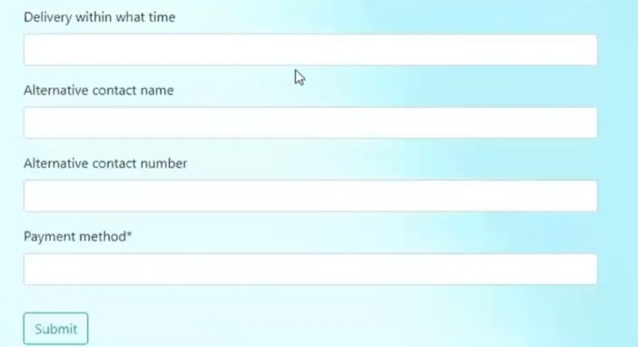

### Employee

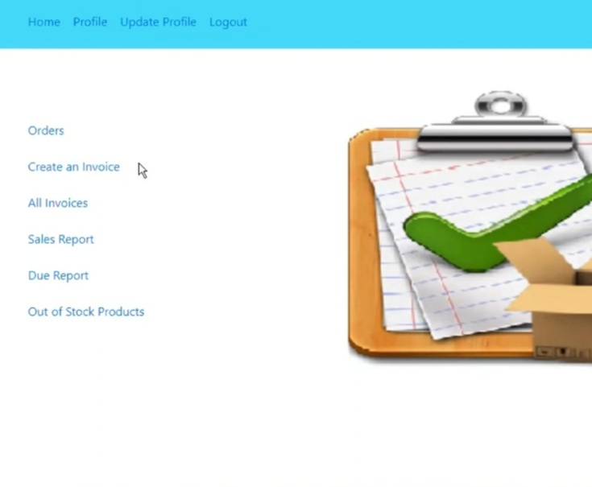

#### Creating New Invoice Form

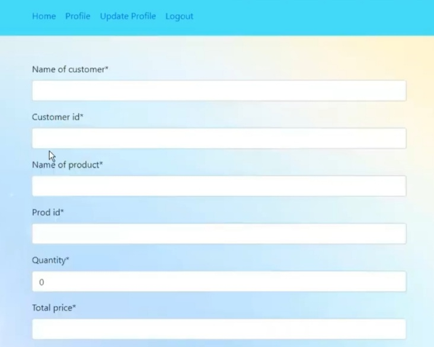

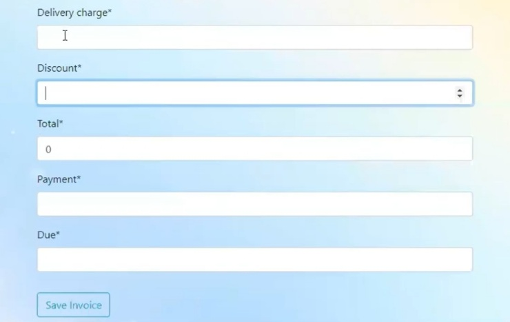

#### All Invoice List and Delete Invoice

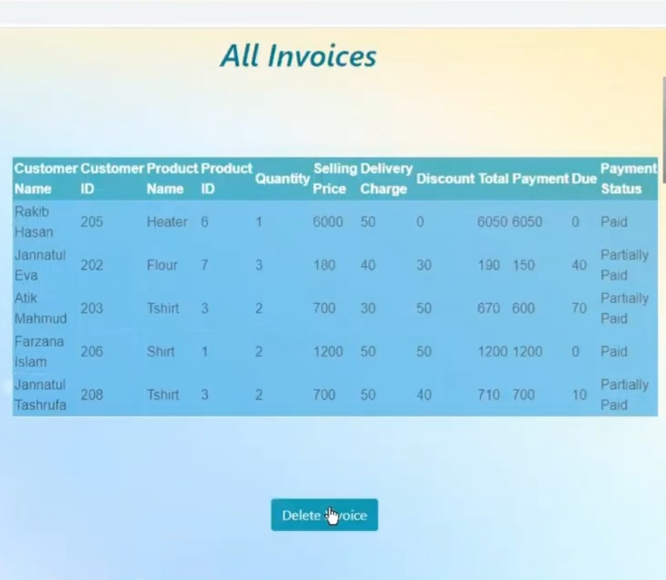

#### Sales Report

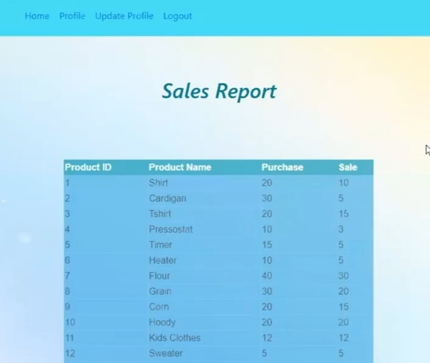

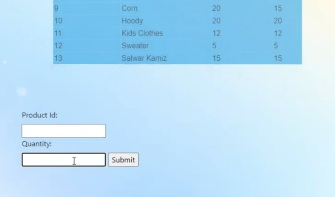

#### Due Report

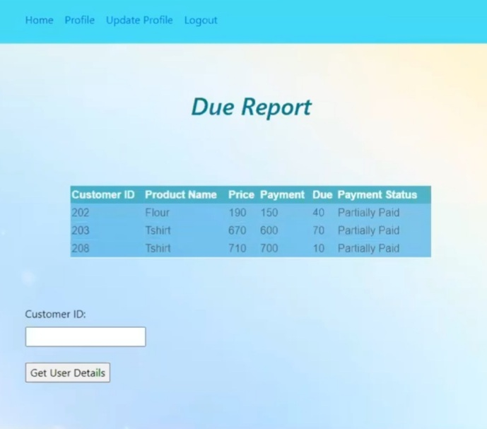

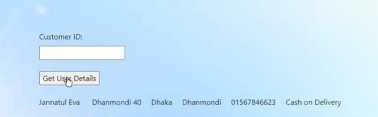

#### Out of Stockn Product

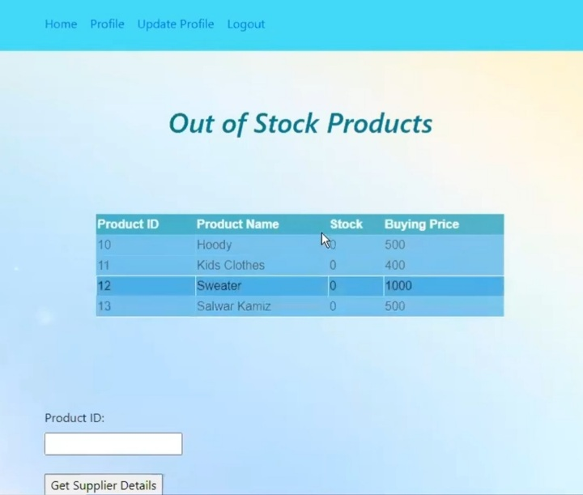

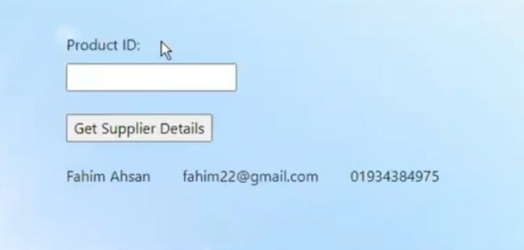

