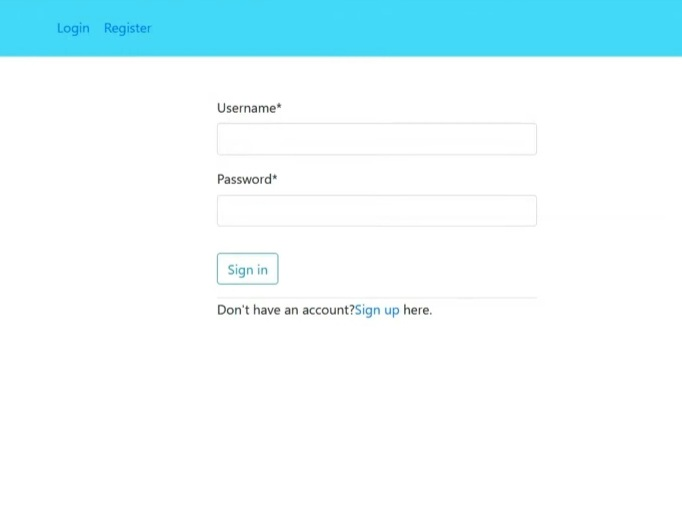

## Inventory Management System with Automated Web Testing using Python and Selenium
<small> This project is an Inventory Management System with Automated Web Testing that streamlines product tracking, stock updates, supplier management, and sales monitoring. The system ensures accuracy and efficiency through real-time inventory control and automated testing to validate core functionalities across workflows. This project has three types of users: admin, customer and employee. These are the features of this system for each type of users:
Customer: Buy products (three categories: clothes, electronics, food), add customer details.
Employee: Create new invoice, view all invoice list, delete invoice, view sales report, view due report, view out of stock product list. 
Admin: Add new product, view stock report.
Every type of user can do registration, login, logout, change Password and update profile. </small> 

Django follows the MVC (Model–View–Controller) pattern. Functionalities of view include displaying webpages, accepting requests from users, rendering webpages, etc. Functionalities of model include storing data in the database, fetching data from the database, deleting data, updating data, etc. The controller accepts the user request from the view. The controller fetches data from the model, and the model gives the requested data to the controller. The controller sends these requested data to the user through the view. The controller renders the requested webpage to the user through the view. In Django, urls.py performs the functionalities of the view of MVC, views.py performs both the functionalities of the view and controller of MVC, and models.py performs the functionalities of the model of MVC. In Django, when a user clicks on a link on a webpage, the system searches for that URL in the urls.py file. In the urls.py file, a function will be present corresponding to that URL. This function will be fully written in a particular views.py file. So, in Django, when a user clicks on a link on a webpage, the system finds that URL in urls.py, goes to its corresponding function (written in views.py), and performs the actions written in that function. 

### Final Result of Project
#### Login Page

django.contrib.auth is a built-in Django module that handles authentication related functionalities. auth_ views.LoginView is used to display the login form. This form will be shown in the login.html page when the user clicks on the login link.

#### Registration form for new users

In this registration page, when request.method=="POST", the data submitted through the form is received. UserRegistrationForm is used to take input from the user and if form. is_ valid() is true, the user information is saved in the database. The user type is also saved in the Usertype model. After that, the user is authenticated using authenticate (username =uname, password =psw) and the user is logged into the system using login (request, new_user), and finally redirected to the home page.

#### Front Page

#### Update Profile
This page updates the user profile. Two forms are here in this page: UserUpdateForm and ProfileUpdateForm. When the form is submitted, request.method=="POST" checks whether the data is coming from the submitted form. Both forms are validated using is_valid() and then the submitted info are saved into the database. If there is any error, render (request, 'customer/ profileUpdate. html', context) is used to load the profile update page again and display the error.

#### Change Password
django.contrib.auth is a built-in Django module that provides authentication functionalities such as login, logout, and password change. auth _views .PasswordChangeView is used to display the password change form and this form will be shown on the pass_change .html page when the user clicks on the 'change password' link. auth_ views .PasswordChangeDoneView is used to display the success message after the password is changed.

#### Log Out
django.contrib.auth is a built-in Django module that handles authentication functionalities. auth_ views.LogoutView is used to log the user out and it will show a logout message when the user clicks on the logout link.

### Admin

#### Adding New Product Form

#### Stock Report

### Customer
#### Buy Products

#### Buy Clothes

#### Buy Electronics

#### Buy Food

#### Adding Customer Details Form

### Employee

#### Creating New Invoice Form

#### All Invoice List and Delete Invoice

#### Sales Report

#### Due Report

#### Out of Stockn Product

